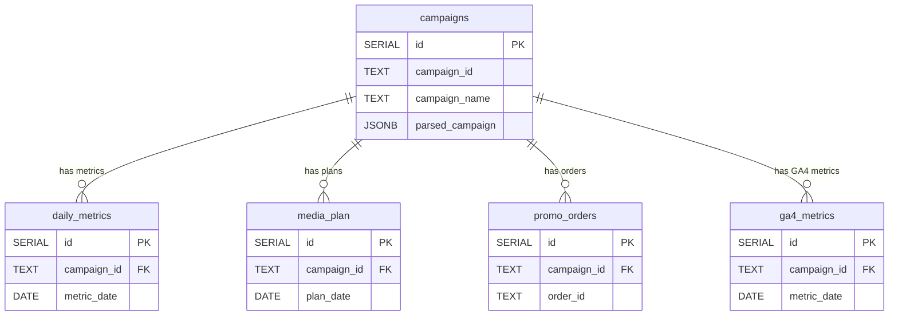

# Core Table Structures

Документация по структурам таблиц для системы аналитики рекламных кампаний.

## Таблица `campaigns`

- id: SERIAL PRIMARY KEY
- campaign_id: TEXT NOT NULL UNIQUE
- campaign_name: TEXT NOT NULL
- parsed_campaign: JSONB
- account_id: TEXT
- objective: TEXT
- status: TEXT
- daily_budget: NUMERIC
- adset_id: TEXT
- adset_name: TEXT
- ad_id: TEXT
- campaign_type: TEXT
- campaign_goal: TEXT
- source: TEXT
- restaurant: TEXT
- city: TEXT
- created_at: TIMESTAMPTZ DEFAULT NOW()
- updated_at: TIMESTAMPTZ DEFAULT NOW()

## Таблица `daily_metrics`

- id: SERIAL PRIMARY KEY
- campaign_id: TEXT NOT NULL REFERENCES campaigns(campaign_id) ON DELETE CASCADE
- metric_date: DATE NOT NULL
- impressions: INTEGER
- clicks: INTEGER
- spend: NUMERIC
- reach: INTEGER
- cpm: NUMERIC
- cpc: NUMERIC
- ctr: NUMERIC
- created_at: TIMESTAMPTZ DEFAULT NOW()
- updated_at: TIMESTAMPTZ DEFAULT NOW()
- UNIQUE(campaign_id, metric_date)

## Таблица `media_plan`

- id: SERIAL PRIMARY KEY
- campaign_id: TEXT NOT NULL REFERENCES campaigns(campaign_id) ON DELETE CASCADE
- plan_date: DATE NOT NULL
- planned_budget: NUMERIC
- planned_impressions: INTEGER
- planned_clicks: INTEGER
- created_at: TIMESTAMPTZ DEFAULT NOW()
- updated_at: TIMESTAMPTZ DEFAULT NOW()
- UNIQUE(campaign_id, plan_date)

## Таблица `promo_orders`

- id: SERIAL PRIMARY KEY
- campaign_id: TEXT NOT NULL REFERENCES campaigns(campaign_id) ON DELETE CASCADE
- order_id: TEXT NOT NULL UNIQUE
- promo_code: TEXT
- order_date: DATE
- revenue: NUMERIC
- created_at: TIMESTAMPTZ DEFAULT NOW()
- updated_at: TIMESTAMPTZ DEFAULT NOW()

## Таблица `ga4_metrics`

- id: SERIAL PRIMARY KEY
- campaign_id: TEXT NOT NULL REFERENCES campaigns(campaign_id) ON DELETE CASCADE
- metric_date: DATE NOT NULL
- users: INTEGER
- sessions: INTEGER
- pageviews: INTEGER
- conversions: INTEGER
- created_at: TIMESTAMPTZ DEFAULT NOW()
- updated_at: TIMESTAMPTZ DEFAULT NOW()
- UNIQUE(campaign_id, metric_date)

## Entity-Relationship Diagram (Mermaid)

